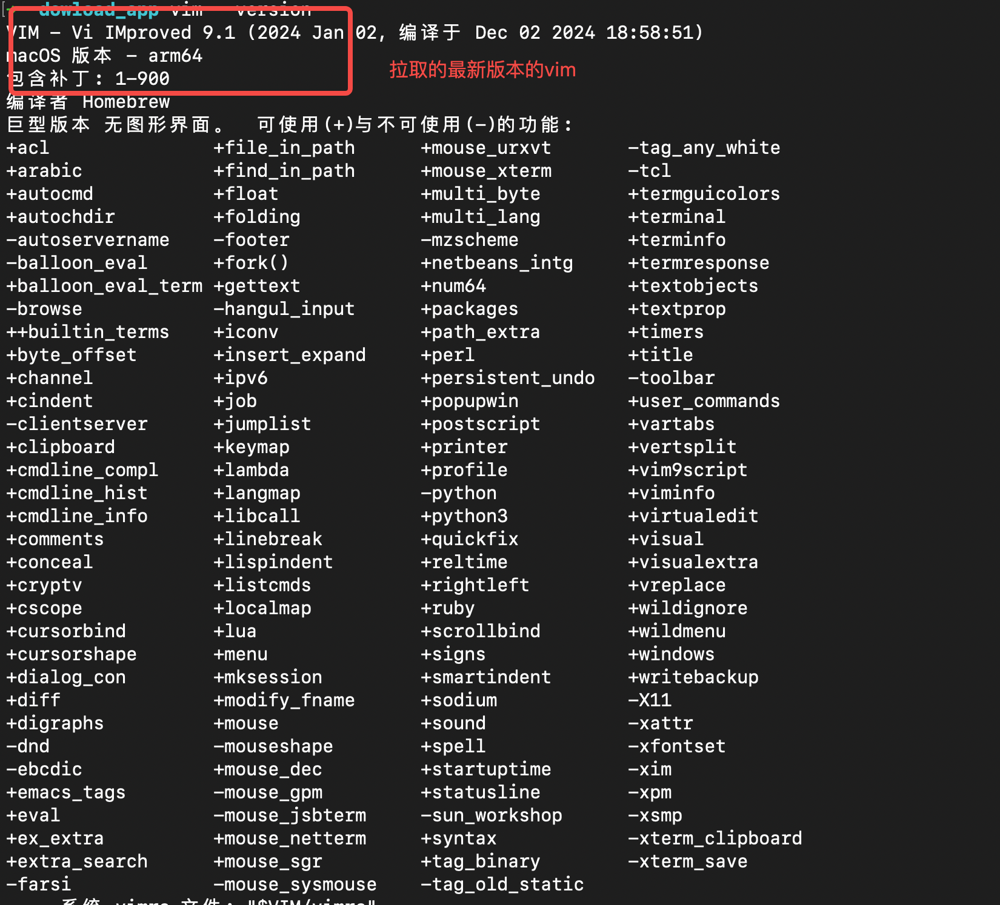
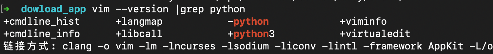

# MAC vim 支持python特性

> - Vim 是强大高效灵活优雅的文本编辑器；
> - 使用 Vim 是复利投资，也是有趣的探索；
> - 所有常见操作系统都有 Vim，你的电脑里可能已经预装了它；
> - Vim 有无数强大插件可以提升你的编辑效率；
> - 要开始使用 Vim，掌握几个基本功能就够了；
> - 唯一需要的，是不断尝试、总结、改进的练习心态；

1. 查看vim是否支持python

   ```bash
   vim --verison |grep python
   ```

   > 如果vim出来-python这种字样，表示暂不支持

2. 安装python

   1. 个人建议安装最新版python

      1. ```bash
         brew install python3
         ```

         1. 

3. 安装vim

   1. 使用brew 安装即可

      1. ```bash
         brew install vim
         ```

         1. 

4. 查看特性是否支持

   1. ```bash
      vim --version |grep python
      ```

      1. 

5. 关于brew，本人认为是很方便的工具

   1. ```bash
      /bin/bash -c "$(curl -fsSL https://raw.githubusercontent.com/Homebrew/install/HEAD/install.sh)"
      ```

      